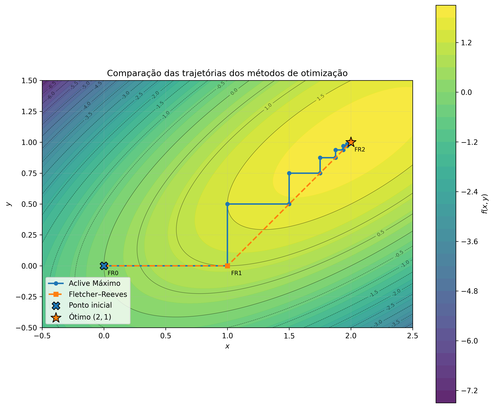

# PPC #4 — Otimização Multidimensional

Implementação e comparação de dois métodos numéricos de otimização multidimensional sem restrições:

* **Método do Aclive Máximo** (*Steepest Ascent*);
* **Método dos Gradientes Conjugados de Fletcher–Reeves**.

O projeto foi desenvolvido em um **Jupyter Notebook** para a disciplina de **Cálculo Numérico Aplicado**.

---

## Objetivo

O objetivo deste trabalho é maximizar a função

$$
f(x,y)=2xy+2x-x^2-2y^2
$$

utilizando dois métodos iterativos diferentes e comparar suas trajetórias de convergência.

O ponto de máximo analítico da função é

$$
(x^\ast,y^\ast)=(2,1),
$$

para o qual

$$
f(x^\ast,y^\ast)=2.
$$

Os dois métodos partem do mesmo ponto inicial, informado pelo usuário durante a execução do notebook.

---

## Métodos implementados

### Aclive Máximo

No método do Aclive Máximo, a direção de busca em cada iteração é dada pelo gradiente da função:

$$
\mathbf{p}_k=\nabla f(\mathbf{x}_k).
$$

Para a função estudada:

$$
\nabla f(x,y)=
\begin{bmatrix}
2y+2-2x\
2x-4y
\end{bmatrix}.
$$

O novo ponto é calculado por

$$
\mathbf{x}_{k+1}
================

\mathbf{x}_k+h_k\mathbf{p}_k.
$$

Esse método normalmente apresenta uma trajetória em **zigue-zague**, pois a direção de busca é substituída pelo gradiente atual em cada iteração.

### Gradientes Conjugados de Fletcher–Reeves

No método de Fletcher–Reeves, a primeira direção de busca também é definida pelo gradiente:

$$
\mathbf{p}_0=\nabla f(\mathbf{x}_0).
$$

Nas iterações seguintes, a direção incorpora informações da direção anterior:

$$
\mathbf{p}_{k+1}
================

\nabla f(\mathbf{x}_{k+1})
+
\beta_k\mathbf{p}_k,
$$

em que

$$
\beta_k=
\frac{
\left|\nabla f(\mathbf{x}_{k+1})\right|^2
}{
\left|\nabla f(\mathbf{x}_k)\right|^2
}.
$$

Por utilizar direções conjugadas, esse método tende a seguir um caminho mais direto em direção ao ponto ótimo.

---

## Busca unidimensional

Os dois métodos utilizam a mesma busca unidimensional para determinar o passo ótimo.

Para um ponto atual $\mathbf{x}_k$ e uma direção $\mathbf{p}_k$, define-se:

$$
g_k(h)=f\left(\mathbf{x}_k+h\mathbf{p}_k\right).
$$

O valor de $h$ que maximiza $g_k(h)$ é estimado por **interpolação quadrática de três pontos**.

A estimativa do vértice da parábola interpoladora é dada por:

$$
h_3=
\frac{
g(h_0)(h_1^2-h_2^2)
+g(h_1)(h_2^2-h_0^2)
+g(h_2)(h_0^2-h_1^2)
}{
2g(h_0)(h_1-h_2)
+2g(h_1)(h_2-h_0)
+2g(h_2)(h_0-h_1)
}.
$$

A implementação também trata situações em que a parábola é degenerada ou em que o ponto calculado está fora do intervalo de busca.

---

## Critério de convergência

O erro utilizado nos dois métodos é o módulo do gradiente:

$$
\text{erro}_k=
\left|\nabla f(\mathbf{x}_k)\right|.
$$

A execução é encerrada quando:

$$
\left|\nabla f(\mathbf{x}_k)\right|<\varepsilon.
$$

---

## Tecnologias utilizadas

* Python 3;
* Jupyter Notebook;
* NumPy;
* Matplotlib.

---

## Estrutura do projeto

```text
.
├── CNA PPC4.ipynb
├── output1.dat
├── output2.dat
├── function.dat
├── trajetorias_ppc4.png
└── README.md
```

### Arquivos gerados

* `output1.dat`: histórico das iterações do Aclive Máximo;
* `output2.dat`: histórico das iterações de Fletcher–Reeves;
* `function.dat`: valores da função objetivo sobre uma malha bidimensional;
* `trajetorias_ppc4.png`: gráfico com as curvas de nível e as trajetórias dos dois métodos.

Os arquivos `output1.dat` e `output2.dat` seguem o formato:

```text
iter erro h x y dfdx dfdy
```

O arquivo `function.dat` segue o formato:

```text
x y f
```

---

## Execução

Clone o repositório:

```bash
git clone URL_DO_REPOSITORIO
cd NOME_DO_REPOSITORIO
```

Instale as dependências:

```bash
pip install numpy matplotlib jupyter
```

Inicie o Jupyter Notebook:

```bash
jupyter notebook
```

Abra o arquivo:

```text
CNA PPC4.ipynb
```

Execute todas as células em ordem. Na célula principal, o programa solicitará os valores iniciais de $x$ e $y$.

Um ponto inicial recomendado para observar claramente a diferença entre os métodos é:

```text
x₀ = 0
y₀ = 0
```

---

## Visualização dos resultados

O notebook gera um gráfico contendo:

* as curvas de nível da função objetivo;
* a trajetória do Aclive Máximo;
* a trajetória de Fletcher–Reeves;
* o ponto inicial;
* o ponto ótimo analítico $(2,1)$;
* a identificação das iterações.



A visualização evidencia o comportamento característico dos métodos:

* o **Aclive Máximo** apresenta sucessivas mudanças de direção, formando uma trajetória em zigue-zague;
* o **Fletcher–Reeves** utiliza as informações das direções anteriores e converge para o ótimo por um caminho mais direto.

---

## Resultado esperado

Independentemente do método utilizado, espera-se a convergência para:

$$
\mathbf{x}^\ast=
\begin{bmatrix}
2\
1
\end{bmatrix}
$$

com valor máximo:

$$
f(\mathbf{x}^\ast)=2.
$$

Para uma função quadrática bidimensional e uma busca linear suficientemente precisa, o método de Fletcher–Reeves pode alcançar o ponto ótimo em poucas iterações.

---

## Conclusão

Os dois métodos foram capazes de localizar numericamente o máximo da função objetivo.

O Aclive Máximo possui uma implementação mais simples, porém pode exigir um número **muito** maior de iterações devido ao comportamento oscilatório de sua trajetória.

O método de Fletcher–Reeves apresentou maior eficiência para o problema analisado, utilizando direções conjugadas para reduzir o zigue-zague e avançar mais diretamente em direção ao ponto ótimo.
