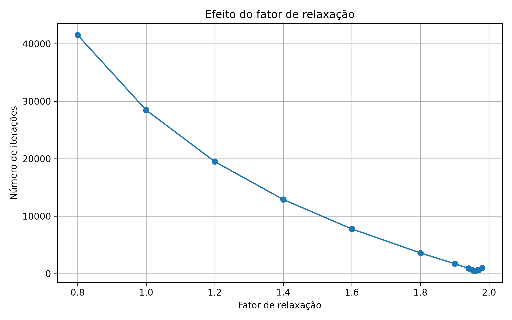
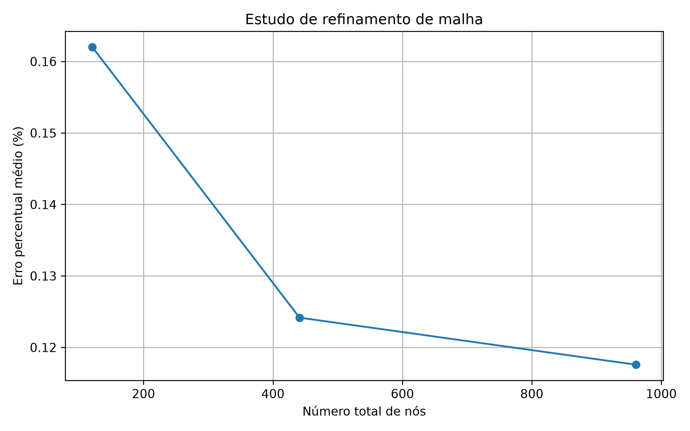
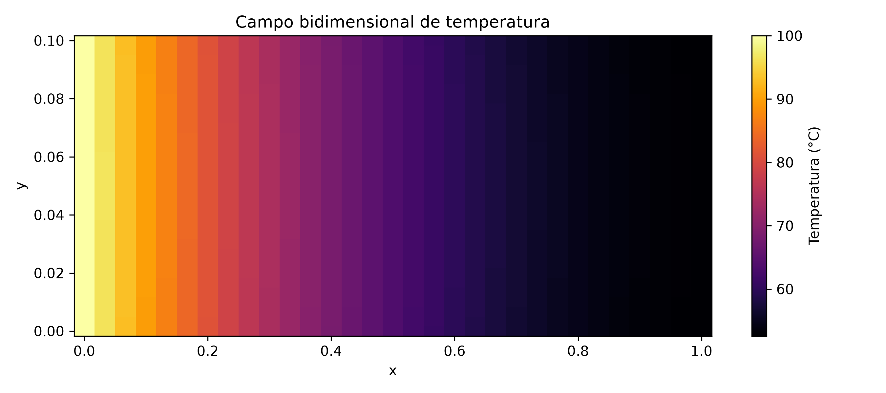
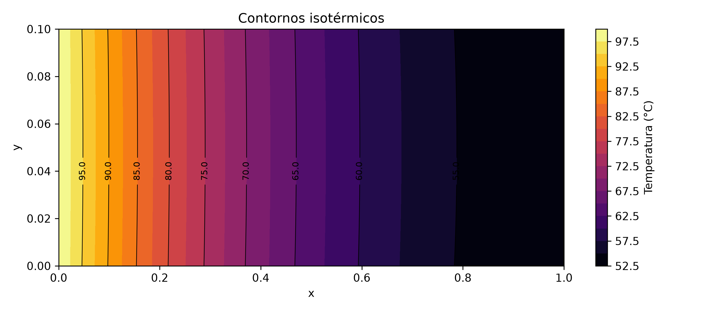
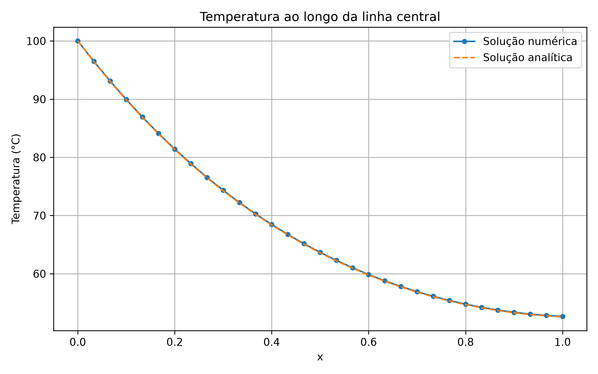

# PPC #6 — Condução Bidimensional de Calor em uma Aleta

## Consulta rápida

| Pergunta | Resposta |
|---|---|
| Qual problema é resolvido? | Condução bidimensional de calor em regime permanente em uma aleta retangular |
| Qual método de discretização é usado? | Método das Diferenças Finitas |
| Quais métodos resolvem o problema? | Eliminação de Gauss, Liebmann e Liebmann com relaxação |
| Onde está o código? | [`Liebmann-Gauss-Seidel.py`](Liebmann-Gauss-Seidel.py) |
| Como ocorre a validação? | Comparação entre os três métodos e com a solução analítica unidimensional |
| O que é gerado? | Arquivos `.dat` e gráficos armazenados em [`resultados/`](resultados/) |

## Resumo operacional

O programa resolve a equação de Laplace para uma aleta retangular:

$$
\frac{\partial^2 T}{\partial x^2}
+
\frac{\partial^2 T}{\partial y^2}
=0,
$$

considerando:

- temperatura prescrita na base, em $x=0$;
- convecção nas superfícies $y=0$, $y=H$ e na extremidade $x=L$;
- regime permanente;
- propriedades constantes;
- ausência de geração interna de calor.

A discretização por diferenças finitas gera um sistema linear, resolvido por três métodos:

1. Eliminação de Gauss com pivoteamento parcial;
2. Método de Liebmann, equivalente ao Gauss–Seidel;
3. Método de Liebmann com sobre-relaxação.

## Formulação numérica

Para os nós internos:

$$
\frac{T_{i+1,j}-2T_{i,j}+T_{i-1,j}}{\Delta x^2}
+
\frac{T_{i,j+1}-2T_{i,j}+T_{i,j-1}}{\Delta y^2}
=0.
$$

Nas superfícies expostas, utiliza-se a condição de Robin:

$$
-k\frac{\partial T}{\partial n}
=
h(T-T_\infty).
$$

No método relaxado, a temperatura é atualizada por:

$$
T_{i,j}^{novo}
=
\omega T_{i,j}^{calculado}
+
(1-\omega)T_{i,j}^{antigo}.
$$

A convergência ocorre quando a maior alteração de temperatura em uma iteração satisfaz:

$$
\max\left|T^{novo}-T^{antigo}\right|
\leq \varepsilon.
$$

## Solução analítica

A temperatura ao longo da linha central é comparada com a solução clássica unidimensional para uma aleta com extremidade convectiva:

$$
\theta(x)=
\frac{
\cosh[m(L-x)]
+
\frac{h}{mk}\sinh[m(L-x)]
}{
\cosh(mL)
+
\frac{h}{mk}\sinh(mL)
},
$$

em que:

$$
\theta=
\frac{T-T_\infty}{T_b-T_\infty},
\qquad
m=
\sqrt{\frac{hP}{kA_c}}.
$$

Foi considerada largura unitária, com $A_c=H$ e $P=2$, representando a troca de calor pelas superfícies superior e inferior.

## Dicionário de variáveis principais

| Variável | Significado | Unidade |
|---|---|---|
| `L` | comprimento da aleta | m |
| `H` | espessura da aleta | m |
| `k` | condutividade térmica | W/(m·K) |
| `h` | coeficiente convectivo | W/(m²·K) |
| `Tb` | temperatura da base | °C |
| `Tamb` | temperatura ambiente | °C |
| `nodes_x`, `nodes_y` | número de nós da malha | adimensional |
| `tol` | tolerância iterativa | °C |
| `omega` | fator de relaxação | adimensional |
| `grid` | campo de temperaturas | °C |

## Dependências

O programa utiliza:

```text
numpy
matplotlib
```

As dependências estão disponíveis no `requirements.txt` da raiz do repositório.

## Como executar

Clone o repositório e entre no diretório do PPC6:

```bash
git clone https://github.com/Betelgeuse990/CNA.git
cd CNA/PPC6
```

Instale as dependências:

```bash
pip install -r ../requirements.txt
```

Execute:

```bash
python Liebmann-Gauss-Seidel.py
```

Em alguns sistemas:

```bash
python3 Liebmann-Gauss-Seidel.py
```

Os parâmetros físicos e numéricos são definidos no início do arquivo Python.

## Estrutura do diretório

```text
PPC6/
├── Liebmann-Gauss-Seidel.py
├── README.md
└── resultados/
    ├── estudo_relaxacao/
    │   ├── estudo_relaxacao.dat
    │   └── estudo_relaxacao.png
    ├── estudo_malha/
    │   ├── estudo_malha.dat
    │   └── estudo_malha.png
    ├── campo_temperatura/
    │   ├── campo_temperatura.dat
    │   ├── mapa_temperatura.png
    │   └── contornos_isotermicos.png
    └── linha_central/
        ├── temperatura_linha_central.dat
        └── temperatura_linha_central.png
```

A pasta `resultados/` e seus subdiretórios são criados automaticamente.

## Validação e resultados

Na malha $11\times11$, os três métodos produziram soluções praticamente idênticas.

| Método | Iterações | Resíduo relativo |
|---|---:|---:|
| Eliminação de Gauss | — | $1{,}152\times10^{-16}$ |
| Liebmann | 28.464 | $4{,}960\times10^{-11}$ |
| Liebmann com $\omega=1{,}50$ | 10.188 | $3{,}302\times10^{-11}$ |

A maior diferença entre Gauss e Liebmann foi de aproximadamente:

$$
1{,}94\times10^{-5}\ ^\circ\text{C}.
$$

Portanto, os métodos convergiram para a mesma solução dentro da precisão adotada.

### Efeito do fator de relaxação

O menor número de iterações entre os valores testados ocorreu para:

$$
\omega=1{,}960,
$$

com 500 iterações na malha $11\times11$. A sobre-relaxação reduziu significativamente o custo iterativo em comparação com o método de Liebmann convencional.



### Refinamento de malha

| Malha | Iterações | Erro percentual médio |
|---|---:|---:|
| $11\times11$ | 500 | 0,161994% |
| $21\times21$ | 2.514 | 0,124161% |
| $31\times31$ | 5.642 | 0,117582% |

O refinamento reduziu o erro médio em relação à solução analítica, mas aumentou o número de iterações e o tempo computacional.



## Campo de temperatura

A temperatura diminui da base aquecida em direção à extremidade da aleta devido à convecção nas superfícies expostas.





## Comparação com a solução analítica

A solução bidimensional ao longo da linha central apresentou boa concordância com o modelo unidimensional. As pequenas diferenças decorrem da representação bidimensional das condições convectivas e da discretização espacial.



## Bibliografia

- CHAPRA, Steven C.; CANALE, Raymond P. **Métodos Numéricos para Engenharia**. 5. ed. McGraw-Hill, 2008.
- GONTIJO, Rafael Gabler. **Notas de aula do curso de Cálculo Numérico Aplicado**. Universidade de Brasília, 2026.
